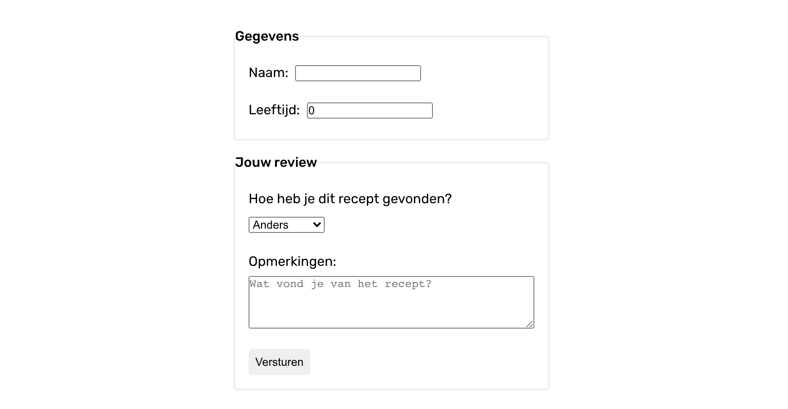

# Opdrachtbeschrijving

## Inleiding
Je gaat een React formulier maken met controlled components. Hiervoor maak je gebruik van de React useState hook.

In jouw formulier komen de volgende inputs te staan:
* _Naam_ - tekstveld
* _Leeftijd_ - getalveld
* _Hoe heb je dit recept gevonden?_ - selectbox met de opties "Google", "Vriend", "Advertentie", "Anders".
* _Opmerkingen_ - tekstareaveld
* _Versturen-knop_ (van type `submit`)

Dit project is opgezet met behulp van [Create React App](https://github.com/facebook/create-react-app).

## Acceptatie criteria
* Alle inputs zijn controlled components
* Wanneer de gebruiker op de versturen-knop klikt, worden alle waarden van de inputvelden in de console gelogt. 
In plaats van een `onClick` eventlistener op de button te plaatsen, mag je de `onSubmit` event-listener op het `<form>`-element plaatsen! 
Deze wordt automatisch getriggerd wanneer er geklikt wordt op een button met `type=submit` in het formulier. 
* Omdat de button een `submit` button is, zal de pagina automatisch herladen wanneer je erop klikt. Zorg dat je dit voorkomt. 
_Tip_: lees [dit](https://www.robinwieruch.de/react-preventdefault) artikel over `preventDefault()` in React.

**Bonus:**: Snel klaar met deze opdracht? Het is mogelijk (en in de parktijk ook gebruikelijk) om slechts één functie en één state variabele te 
gebruiken waarmee álle `onChange` listeners worden afgevangen. Als je hier mee wil experimenteren kun je [dit](https://www.pluralsight.com/guides/handling-multiple-inputs-with-single-onchange-handler-react) 
artikel gebruiken als leidraad. Lees vooral het kopje "Multiple Inputs" en het stuk over "Checkbox Inputs". De antwoorden voor deze aanpak staan op de branch _uitwerkingen-bonus_.

**Bonus 2:** Make it look nice! 😍

## De applicatie starten
Als je het project gecloned hebt naar jouw lokale machine, installeer je eerst de node_modules door het volgende commando in de terminal te runnen:

`npm install`

Wanneer dit klaar is, kun je de applicatie starten met behulp van:

`npm start`

of gebruik de WebStorm knop (npm start). Open http://localhost:3000 om de pagina in de browser te bekijken. Begin met het maken van wijzigingen in `src/App.js`: elke keer als je een bestand opslaat, zullen de wijzigingen te zien zijn op de webpagina.